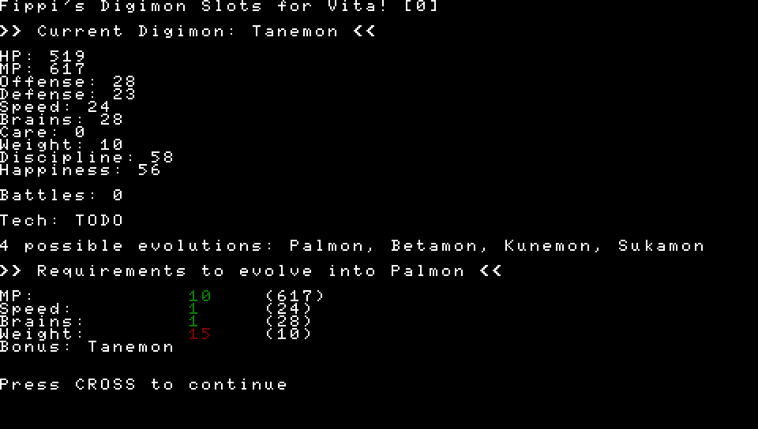

# Fippi's Digislots for PS Vita

This tool is a Playstation Vita homebrew application that is similar to the [digislots web app](https://digislots.fippi.io).

Currently, the tool reads the PSX/PSP save file from `ux0:/pspemu/PSP/SAVEDATA/SLUS01032/SCEVMC0.VMP` and uses it to determine your current digimons stats. It then chooses a random valid digimon evolution and displays the required criteria for evolving your digimon into it.

This program works only for Digimon World 1 when it's running through Adrenaline and has valid save data stored at the above path. Currently it only supports memory card slot 1, but if you build from source you can modify it to point to `SCEVMC1.VMP` instead.

When running the app, press X at any time to roll for a new random digimon evolution. The app will *not* show any special evolutions i.e. Kunemon, Numemon, Sukamon, Vademon.

## Building from source
1. Install `vitasdk`. Use [vpdm](https://github.com/vitasdk/vdpm) and run the `bootstrap-vitasdk.sh` and `install-all.sh` scripts.
2. Run `cmake .`
3. Run `make`

If all is well, the `.vpk` should be compiled and will be in the root of the repo. See the [github build action](./.github/workflows/build.yml) for more info on how to set up the environment.

## Screenshots

## TODO
- [ ] Display digi's current age & time until next digivolution
- [ ] Read the learned techs from the PSX save. I don't know how this works at the moment and need to do some investigation
- [ ] Add option to exclude digimon that you've already had (i.e. that exist in the tree already)
- [ ] Implement min/max battles / care mistakes. Currently it parses all requirements as if they're minimum requirements
- [ ] Make save file & path configurable
- [ ] Add configurable options for app similar to the web app
- [ ] Add a nice gui. Currently the text-based UI is a bit ugly. Possibly using the vita2d library if I don't find any better ones
- [ ] Add persistent memory - i.e. retain settings as well as the last digimon rolled
- [ ] (maybe) Build another version to be used with emulators i.e. ePSXe and Duckstation

## Special Thanks
- The DW community & DDC / DMC discords as a whole for their willingness to share knowledge about this game 
- SydMontague, fliegenfuerst and rommstar for their crazy amount of work in reverse engineering the DW games and creating tools for them